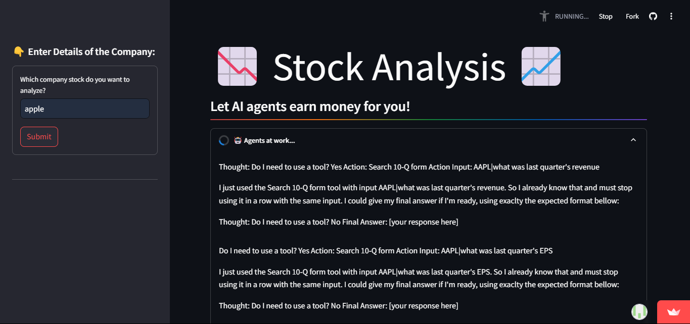
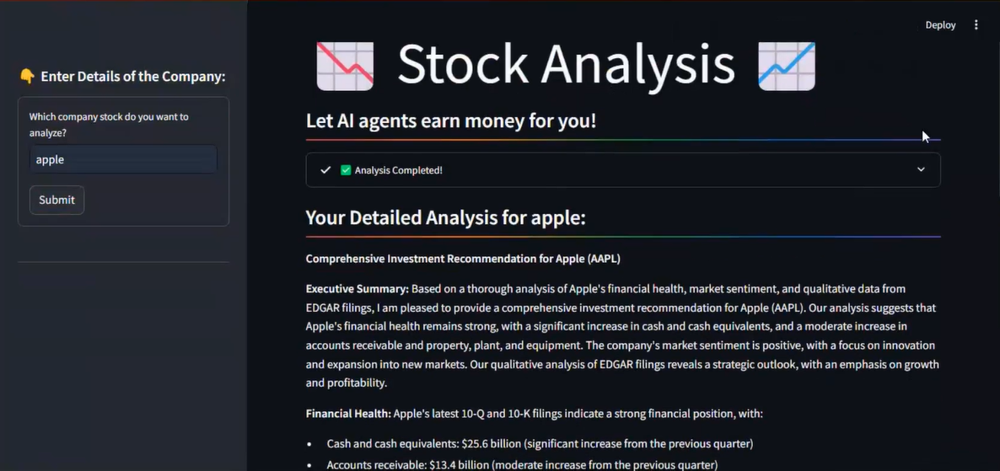

# AI Crew for Stock Analysis
## CrewAI Framework
CrewAI is designed to facilitate the collaboration of role-playing AI agents. In this example, these agents work together to give a complete stock analysis and investment recommendation

## Running the Script
It uses GPT-4 by default so you should have access to that to run it.

***Disclaimer:** This will use gpt-4 unless you changed it 
not to, and by doing so it will cost you money.*

- **Configure Environment**: Copy ``.env.example` and set up the environment variables for [Browseless](https://www.browserless.io/), [Serper](https://serper.dev/), [SEC-API](https://sec-api.io) and [OpenAI](https://platform.openai.com/api-keys)
- **Install Dependencies**: Run `poetry install --no-root`.
- **Execute the Script**: Run `python main.py` and input your idea.

## Details & Explanation
- **Running the Script**: Execute `python main.py`` and input the company to be analyzed when prompted. The script will leverage the CrewAI framework to analyze the company and generate a detailed report.
- **Key Components**:
  - `./main.py`: Main script file.
  - `./stock_analysis_tasks.py`: Main file with the tasks prompts.
  - `./stock_analysis_agents.py`: Main file with the agents creation.
  - `./tools`: Contains tool classes used by the agents.

## Using GPT 3.5
CrewAI allow you to pass an llm argument to the agent construtor, that will be it's brain, so changing the agent to use GPT-3.5 instead of GPT-4 is as simple as passing that argument on the agent you want to use that LLM (in `main.py`).
```python
from langchain.chat_models import ChatOpenAI

llm = ChatOpenAI(model='gpt-3.5') # Loading GPT-3.5

def local_expert(self):
	return Agent(
      role='The Best Financial Analyst',
      goal="""Impress all customers with your financial data 
      and market trends analysis""",
      backstory="""The most seasoned financial analyst with 
      lots of expertise in stock market analysis and investment
      strategies that is working for a super important customer.""",
      verbose=True,
      llm=llm, # <----- passing our llm reference here
      tools=[
        BrowserTools.scrape_and_summarize_website,
        SearchTools.search_internet,
        CalculatorTools.calculate,
        SECTools.search_10q,
        SECTools.search_10k
      ]
    )
```

## Using Local Models with Ollama
The CrewAI framework supports integration with local models, such as Ollama, for enhanced flexibility and customization. This allows you to utilize your own models, which can be particularly useful for specialized tasks or data privacy concerns.

### Setting Up Ollama
- **Install Ollama**: Ensure that Ollama is properly installed in your environment. Follow the installation guide provided by Ollama for detailed instructions.
- **Configure Ollama**: Set up Ollama to work with your local model. You will probably need to [tweak the model using a Modelfile](https://github.com/jmorganca/ollama/blob/main/docs/modelfile.md), I'd recommend adding `Observation` as a stop word and playing with `top_p` and `temperature`.

### Integrating Ollama with CrewAI
- Instantiate Ollama Model: Create an instance of the Ollama model. You can specify the model and the base URL during instantiation. For example:

```python
from langchain.llms import Ollama
ollama_openhermes = Ollama(model="openhermes")
# Pass Ollama Model to Agents: When creating your agents within the CrewAI framework, you can pass the Ollama model as an argument to the Agent constructor. For instance:

def local_expert(self):
	return Agent(
      role='The Best Financial Analyst',
      goal="""Impress all customers with your financial data 
      and market trends analysis""",
      backstory="""The most seasoned financial analyst with 
      lots of expertise in stock market analysis and investment
      strategies that is working for a super important customer.""",
      verbose=True,
      llm=ollama_openhermes, # Ollama model passed here
      tools=[
        BrowserTools.scrape_and_summarize_website,
        SearchTools.search_internet,
        CalculatorTools.calculate,
        SECTools.search_10q,
        SECTools.search_10k
      ]
    )
```

### Advantages of Using Local Models
- **Privacy**: Local models allow processing of data within your own infrastructure, ensuring data privacy.
- **Customization**: You can customize the model to better suit the specific needs of your tasks.
- **Performance**: Depending on your setup, local models can offer performance benefits, especially in terms of latency.
- 
## Screenshots


